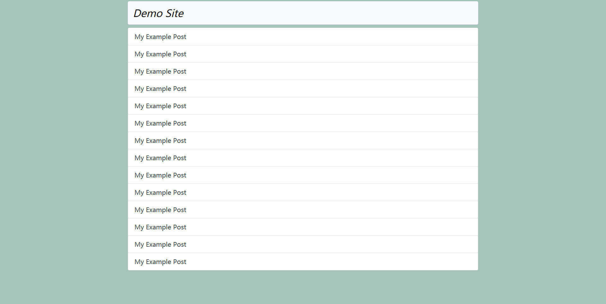

# VntGo
> A super simple theme for Hugo.

## Screenshot


## Installation

### Installing this theme
```
$ cd themes/
$ git clone https://github.com/wuyc/hugo-theme-vntgo.git
```

### Specify vntgo as your default theme in the config.toml file
```
theme = "vntgo"
```

## Acknowledgements
- [Bootstrap](https://github.com/twbs/bootstrap) The most popular HTML, CSS, and JavaScript framework for developing responsive, mobile first projects on the web.
- [Prism](https://github.com/PrismJS/prism) Lightweight, robust, elegant syntax highlighting.

## License
Released under the [MIT License](https://github.com/wuyc/hugo-theme-vntgo/blob/master/LICENSE).